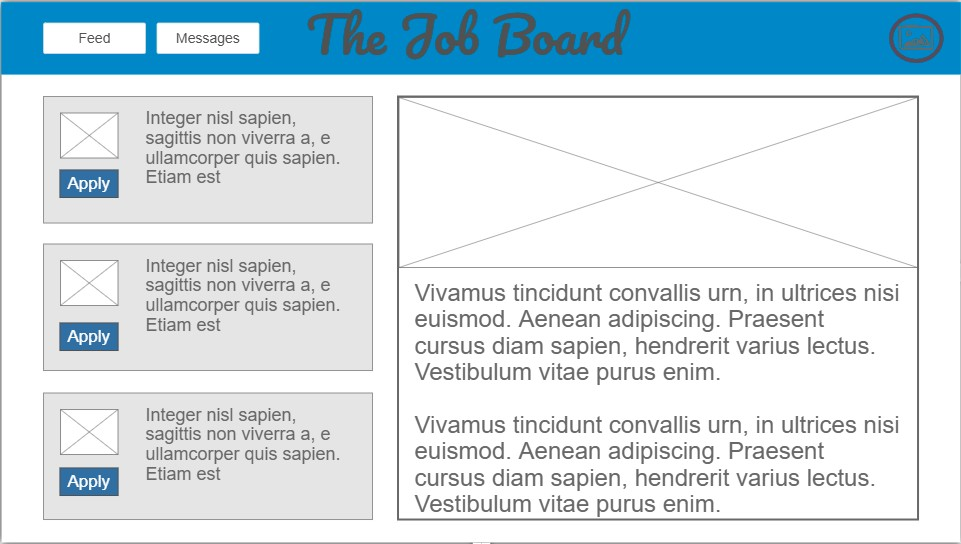

# cs260-startup
My startup project for CS 260

## Elevator Pitch 
Finding and hiring talent shouldn't be complicated. Our streamlined job board makes it easier than ever for businesses to post jobs and for job seekers to apply with just a few clicks. No clutter, no confusion—just fast, effective connections between employers and candidates. Simplify your hiring process today with our intuitive platform. 

## Key Features 
* Secure login over HTTPS
* Profile creation
* Ability to post job positions
* Ability to view job postings
* Chat box for communication
* All data is persistantly stored

## Technologies
* HTML - Use HTML to structure the content on the application. There will be four HTML pages including the profile, feed, profile 
creation, and login. 
* CSS - Styling for the application that creates dynamic sizing and creates a visually appealing website. 
* React - Provides login, updating job posts, creating profiles, used for making basic website components. 
* Service - Retrieving job posts, submitting job posts, retriving profile information 
* DB/Login - Stores profile accounts, store job post information. Can't post job unless authenticated. 
* WebSocket - Used to create a chat feature for users to communicate. 
   
## Design

## IP address and Server Setup
I successfully set up my server configurations and assigned it an elastic IP address. I also was able to remote shell into my server. 

## Amazon Root Services - Route 53
I successfully purchased a domain name. It is project-260-camille. I was able to connect my IP address to the domain name.

## HTTPS, TLS, and Web Certificates 
Using Vim I was able to ssh into my server and create a secure domain.

# HTML Deliverable (Rewritten)
For this deliverable I built out the structure of my application using HTML.

 * HTML pages - Four HTML pages that represent the ability to login, look at feed, edit their profile, and chat with others.
 * Links - The login page automatically links to the feed page. The other pages are linked in the Nav bar.
 * Text - Example feed is given in Lorem Ipsum.
 * Images - Placeholders for images were added.
 * DB/Login - Input box and submit button for login. Profile information is also kept on Database.
 * WebSocket - Placeholders for the chat section were added.

# CSS Deliverable

## Prerequisites 

### CSS Practice 
I learned more about how to make animations with CSS by practicing making the sections move into the screen. I had never done much with animations in CSS before so it has been fun to give it a try. 

### CSS Flexbox 
I learned how flexbox works. I thought it was interesting that setting flex to 0 makes it so the box does not grow. 

### CSS Frameworks
I was surprised how easy it is to add bootstrap elements into my HTML. I have never looked into Tailwind CSS, but I want to learn how to use it more.

### Simon CSS
I cloned the simon css repository and then deployed it to production. I learned that I have to be in the right folder when I deploy the code, otherwise it won't work. 
